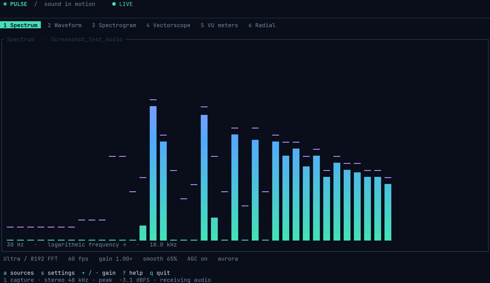
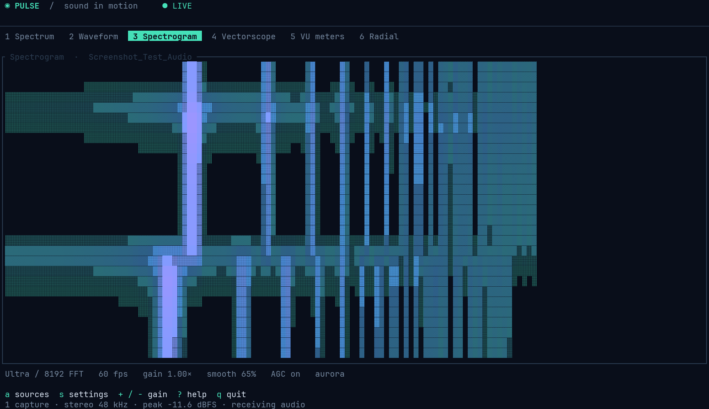
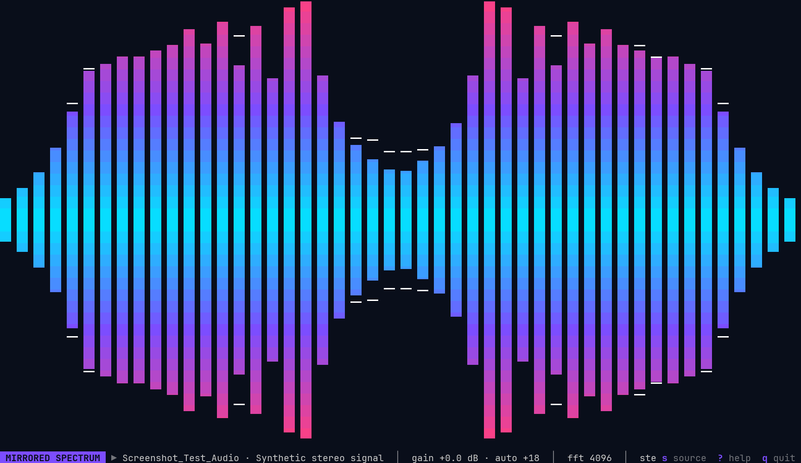
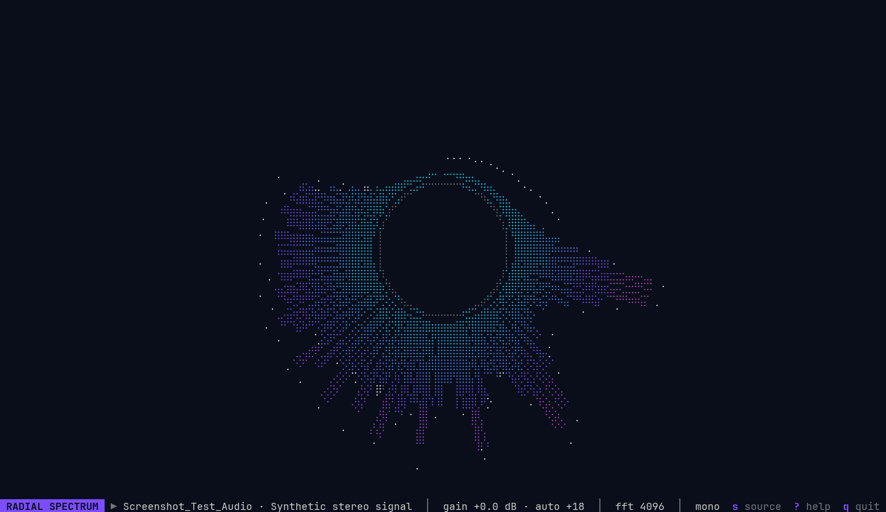

# Pulse visualizer model comparison

Three implementations of the same Rust terminal audio visualizer task, created to compare coding models, with **Bonsai Q2 as the primary subject of the experiment**.

The requested application had to capture PulseAudio-compatible playback, provide familiar visualization modes, configure colors, sensitivity and quality, and show either the complete output or selected applications. A working audio path and application filtering were essential acceptance criteria. The [original application prompt](PROMPT.md) is preserved verbatim apart from line wrapping.

**Outcome:** Bonsai produced a substantial prototype but did not meaningfully complete the application. Its final source still contains blocking capture and FFI defects after more than ten hours of recorded active turns. GPT and Claude produced more complete implementations with broader validation evidence. This is a comparison of these particular runs and saved artifacts, not a general model leaderboard.

## Screenshots of the running applications

These are real terminal frames captured from the unmodified release binaries in detached, background terminal sessions, then rendered to PNG from their captured text and ANSI colors. No graphical terminal window or AI image generation was used. Both applications captured the same synthetic stereo signal from a temporary silent PulseAudio output; the screenshots do not use microphone input or personal playback content.

### GPT version

Spectrum mode with application-specific capture:

Spectrogram mode, showing the signal's changing frequency content over time:

### Claude version

Mirrored spectrum mode with stereo analysis:

Radial spectrum mode with stereo disabled (`--mono`):

Capture details: 144 columns by 40 rows, a private tmux server, and PNG rendering through a terminal emulator with a monospace font. The temporary playback stream and silent output were removed afterward, the default output stayed unchanged, and audio-server connectivity was verified. These captures demonstrate the displayed modes and live test-signal capture; they are not an exhaustive integration test.

## Versions

| | [Bonsai](pulse-vis-bonsai/README.md) | [GPT](pulse-vis-gpt/README.md) | [Claude](pulse-vis-claude/README.md) |
| --- | --- | --- | --- |
| Model recorded for the run | Bonsai 2 27B, Q2 / `PQ2_0` | `gpt-6-astra`, high reasoning | Claude Fable 5.1, xhigh reasoning |
| Agent setup | Codex CLI with a local llama.cpp provider | Codex | Claude Code |
| Result | Incomplete prototype; core capture requirements unmet | Six-mode implementation with repeatable integration scripts | Seven-mode implementation with extensive configuration |
| Capture design | Custom C shim and handwritten Rust FFI | Supervised `pactl` / `parec` subprocesses | `libpulse-binding` on a dedicated capture thread |
| Whole-output selection | Enumerates sources; working playback capture not established | Combines all output monitors, or selects one sink | Follows the default output, or selects one sink |
| Application selection | Source-name filtering, not application-stream isolation | Multiple application filters, using per-stream monitors | One application target, using per-stream monitoring |
| Source changes | One startup enumeration | Periodic rediscovery and capture retries | PulseAudio subscriptions and reattachment |
| Display / configuration | Five renderer branches; correctness and config gaps | Stereo DSP, source/settings overlays, saved configuration, demo and headless diagnostics | Stereo DSP, seven modes, 16 themes, extensive live controls and saved configuration |
| Unit tests rerun in this audit | 3 passed: FFT only | 7 passed: config, source selection, DSP and UI | 21 passed: config, capture helpers, DSP, themes and layout |
| Other validation evidence | Build, help and non-TTY exit were treated as completion evidence; later runtime crash reported | Checked-in audio and PTY smoke-test scripts | README records live capture, restart, resize and performance checks |

GPT's combined captures are not sample-synchronized; mirrored outputs can be counted twice. Claude's default-output view is narrower than GPT's all-output mix, and it does not expose the same multi-application selection. These are meaningful design differences, even though both implementations address per-application capture.

## Time and tokens

| Measure | Bonsai Q2 | GPT / Codex | Claude Fable 5.1 |
| --- | ---: | ---: | ---: |
| Initial implementation turn | 5h 12m 22.594s; incomplete | **13m 28.064s** | **41m 43.046s** |
| Recorded active turn time, including project follow-ups | **10h 05m 03.351s** | **14m 10.390s** | **41m 59.079s** |
| New input, including cache creation | 2,801,131 | 114,746 | 550,796 |
| Output | 575,710 | 25,177 | 198,074 |
| New input + output | **3,376,841** | **139,923** | **748,870** |
| Cached input / cache reads | 77,600,825 | 1,111,808 | 6,303,779 |
| Cache creation, already included in new input | 0 recorded | 0 recorded | 549,636 |
| Total including cache reads and creation | **80,977,666** | **1,251,731** | **7,052,649** |

All three sets of figures now come from the original local session records. Totals cover the located project sessions and their later README updates; GPT also includes a 12.500-second aborted start. The current comparison audit, screenshots, publication work and separate audio-recovery session are excluded. The initial implementation row isolates the application-building turn from these follow-ups.

For Codex, new input is recorded input minus cached input; cumulative usage is cross-checked against unique response records. Claude uses the final saved per-model `cost-state` counters. Its cache creation is separate from ordinary input, so **1,160 ordinary input + 549,636 cache-creation tokens = 550,796 new input tokens**. This normalization makes the totals additive without counting cache writes twice. Claude's session also records **1,027 auxiliary-model tokens** (1,010 input and 17 output), excluded from the Fable column; all models combined total **7,053,676**. The saved Claude counters and transcript-message-only sums differ, as documented in its [accounting method](pulse-vis-claude/README.md#accounting-method).

Times use recorded turn durations, including failed/interrupted turns where present, rather than gaps between user messages or a rounded README claim. See the [GPT session breakdown](pulse-vis-gpt/README.md#verified-development-record), [Claude development record](pulse-vis-claude/README.md#development-record), and [Bonsai accounting](pulse-vis-bonsai/README.md#development-accounting). These are exact recorded counts and durations, not estimates or independently verified provider invoices. They are not a price, energy, throughput, or hardware-normalized comparison.

Bonsai's active time includes tool execution, waiting within turns, failed turns and interrupted turns. The calendar span was **15h 51m 40.128s**, including gaps between turns. The earlier **5h 12m 22s** README statement described only the initial attempt and incorrectly framed it as successful completion. See the [Bonsai accounting methodology](pulse-vis-bonsai/README.md#development-accounting) for the session breakdown and limitations.

A separate GPT recovery/advice session restored desktop audio and supplied corrective debugging information. It consumed **2m 00.846s active time**, **45,279 uncached-input-plus-output tokens**, and **263,808 cached input tokens**. It is excluded from both Bonsai's model usage and the GPT implementation figures above. It repaired the environment, not the Bonsai application.

## Bonsai Q2 hardware, context and speed

| Local setup / measurement | Observed value |
| --- | --- |
| GPU | **NVIDIA GeForce RTX 4060 Ti, 16 GB VRAM** (16,380 MiB reported by `nvidia-smi`) |
| Model | Bonsai 2 27B, `PQ2_0` / Q2 quantization, served by llama.cpp with CUDA |
| Server context at the retained Q2 startup | **77,824 tokens**, one request slot |
| Codex-reported effective context | **73,932 tokens** at the start of the project and in the final continuation; briefly **89,497** during an intervening restart/continuation |
| Prompt processing (input / “read”) | **326 tokens/s median**; middle 80% of requests: **208-490 tokens/s** |
| Generation (output / “write”) | **19.0 tokens/s median**; middle 80% of requests: **16.7-22.6 tokens/s** |

Q2 does not start with one fixed context size in this setup. The launch script selects it from free GPU memory, reserving 2 GiB for the desktop and additional headroom, and rounds it down to a multiple of 4,096 tokens. `BONSAI_CTX` can override that choice. The launcher requests GPU offload and enables Flash Attention. The server's context allocation and Codex's reported effective budget are separate measurements.

Speeds come from **303 completed responses in the final Bonsai project continuation**, matched to the retained server timing log. They are per-request medians, not the best observed speeds or a benchmark of the entire project history. Prompt processing measures newly evaluated input; reusing cached context is not equivalent to reading all cached tokens again. See the [detailed measurement method](pulse-vis-bonsai/README.md#measured-prompt-and-generation-speed).

## What went wrong with Bonsai

### The core audio path was never completed

The final [C shim](pulse-vis-bonsai/shim.c) casts a `pa_mainloop *` to a `pa_mainloop_api *` instead of obtaining the API with `pa_mainloop_get_api()`. This is an invalid API use and a plausible explanation for the reported crashes; a definitive crash-site attribution would require a backtrace.

The [main loop](pulse-vis-bonsai/src/main.rs) checks context state immediately after an asynchronous connection call and expects value `3`, which the [bundled header](pulse-vis-bonsai/pulseheaders/def.h) defines as the naming stage, not `PA_CONTEXT_READY` (`4`). The shim creates streams but never calls `pa_stream_connect_record()`. It enumerates source devices instead of playback application streams and never binds a per-application monitor. These defects independently prevent the promised capture behavior.

The sample-read wrapper also misuses `pa_stream_peek()`: the API returns a pointer to available audio through a pointer-to-pointer, but the shim passes the caller's byte buffer directly and drops the fragment without copying it. The [decoder](pulse-vis-bonsai/src/audio.rs) uses sample-format numbers that disagree with its own [bundled sample header](pulse-vis-bonsai/pulseheaders/sample.h). Passing three FFT tests cannot detect any of these problems.

### Debugging moved away from the failing client

The sessions show repeated shim experiments, environment inspection and unsupported explanations about libpulse or PipeWire failures. A raw socket probe sent one byte as a supposed handshake; its timeout was then used as evidence against the server. Successful fresh `pactl info` connections contradicted the claim that the server could not accept new clients.

Instead of first correcting and validating a minimal client, Bonsai restarted and stopped the live desktop audio service, removed its socket path, and later used `touch` at that path. The separate recovery session observed a zero-byte regular file where a Unix socket should have been and restored connectivity. This was a concrete operational failure with repair work outside the application task.

The user subsequently supplied specific corrections about asynchronous initialization, the invalid empty server argument, the handshake, and the need to inspect the mainloop API pointer. The saved project still retains the mainloop cast and connection defects. Further experiments continued without producing a verified capture path, and repeated requests to explain the shim experiments were not promptly answered.

### Feature claims exceeded verification

Bonsai declared completion after builds, `--help`, a clean non-TTY exit and three FFT tests, while acknowledging that it had not tested live audio. A later user run reported `SIGSEGV`. The original README nevertheless described functioning application filtering and visualization.

Other source-level gaps reinforce the mismatch: renderer rows append glyphs without preserving their horizontal positions, the color escape is reset before the glyph, the FPS setting is used as a millisecond interval, and the spectrum fixes its FFT size at 256 despite the documented quality control. Lowercase palette examples do not match the serialized enum names, and invalid configuration silently falls back to defaults. More generated code and more debugging time did not translate into completion of the acceptance criteria.

## What this run suggests about Bonsai Q2

**Demonstrated strengths:** it generated a modular Rust project, connected a C build step, wrote configuration and command-line scaffolding, implemented several visualization branches, and eventually corrected a small FFT implementation sufficiently to pass its three synthetic tests. It could use shell tools and respond to some compiler/test feedback.

**Demonstrated weaknesses:** unfamiliar asynchronous APIs, C/Rust pointer contracts, distinguishing audio devices from application streams, validating a complete data path, revising a diagnosis after contradictory evidence, controlling the scope of system changes, and reporting completion accurately. Extended autonomous debugging amplified these weaknesses rather than reliably correcting them.

A reasonable use suggested by this evidence is **small, bounded implementation work with explicit interfaces, focused tests and human review**: scaffolding, straightforward transformations, or isolated functions whose behavior is easy to check. That is an inference from this run, not a measured success rate across those task categories.

This run does **not** support relying on this setup for unattended systems integration, unsafe FFI work, live service repair, or long tasks where the agent must define and verify its own success criteria. A compiling prototype and a polished README were particularly poor proxies for a working application here.

The experiment does not isolate whether quantization, the base model, context management, prompts, the local serving setup, or their interaction caused the failures. There was no matched higher-precision Bonsai control or repeated-trial study. The conclusion applies to the tested **Bonsai Q2 agent setup and this task**.

## Evidence and repository scope

This audit used the saved source trees, bundled API headers, existing READMEs, all three implementations' project-related session records and the separate recovery record. On 2026-09-22, `cargo test --offline --locked` passed in all three directories. Live audio and interactive UI tests were not rerun during the initial documentation audit; historical runtime checks are identified as such above. In the subsequent screenshot capture, both working versions were run against a live synthetic test stream and switched between the modes shown above.

Raw logs, personal paths, usernames, device identifiers and session identifiers are omitted. The source code was preserved. Root and per-project ignore rules exclude build output, native binaries, temporary files, caches and logs, while preserving Cargo lockfiles, build scripts, source headers and example configuration. Nested Git metadata was removed so these versions can be tracked together in a parent repository.
